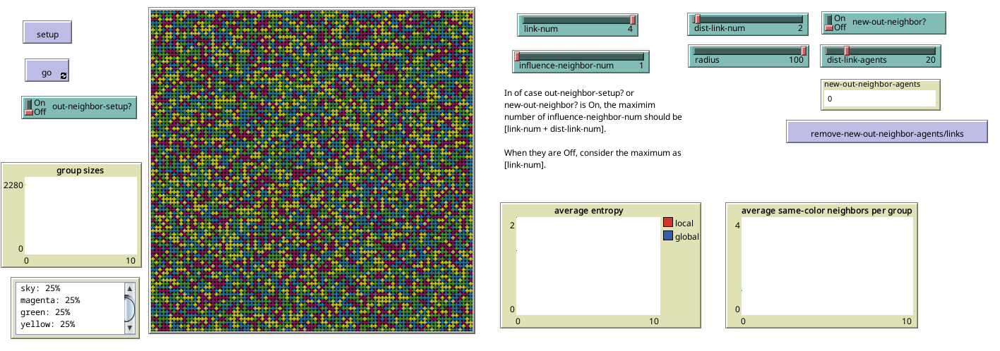

# NetLogo Model of Structure of Social Interaction

## Table of Contents

- [Overview](#overview)

- [Getting Started](#getting-started)

- [Theoretical Underpinning](#theoretical-underpinning)

- [Use Case Example](#use-case-example)

- [Structure of the Model](#structure-of-the-model)

- [Some Mathematical Interpretations](#some-mathematical-interpretations)

- [Note on Limitations](#note-on-limitations)

- [Miscellaneous](#miscellaneous)

## Overview

This NetLogo agent-based model is designed to simulate the structure of social interactions and their effects on emergent patterns within the system. The model draws inspiration from Peter Hedström’s *Dissecting the Social: On the Principles of Analytical Sociology* (2005), where he explores models of social interaction influenced by cellular automata.

While emphasizing micro-level interactions among agents and their impact on broader emergent macro-level phenomena, the model offers valuable insights into sociological concepts such as social diversity, group formation and disintegration, homophily, and clustering — all shaped by the underlying structure of social interactions.

The model’s design forms part of the author’s research project and serves as an educational tool to demonstrate the connection between micro and macro social processes, suitable for use in introductory or computational sociology courses.

## Getting Started

To run the model:

1. Open the `.nlogo` file in NetLogo 6.3.0 (or above).
2. Set the switches and sliders as shown in the image below.
3. Press `setup`, then `go` and and follow the instructions in the [Use Case Example](#use-case-example).

## Theoretical Underpinning

The model posits a system of autonomous agents operating under predetermined rules, each situated within a neighborhood comprising four similar agents. The population consists of four distinct groups, differentiated by color, whose interactions are analyzed from an overhead perspective.

The model conceptualizes agents embedded in a network, each linked to their neighbors, forming a structured pattern of interaction.

  

In general, each agent (referred to as *Ego*) is linked to four neighbors ($Alter_{1 \dots n}$​) located within the Von Neumann neighborhood. Each agent interacts with a subset of these neighbors, ranging from 1 up to $n$. In the immediate Von Neumann neighborhood, an agent interacts with up to four neighbors.

During interactions, agents may change their color as a result of influence exerted by their neighbors. Influence here refers to the effect of social interaction that induces a change in the agent’s state. Specifically, in this model, an agent adopts the dominant color among its linked neighbors, contingent upon the structure of these links and the presence of interaction.

An agent can be influenced by any number k of neighbors, where $k$ may be 1, 2, 3, 4, or any value up to $n$. The figure above illustrates a case where $k=2$; in this scenario, the agent adopts the color 'red' because 'red' is the dominant color among the two neighbors influencing it. The model allows the introduction of more neighbors by the observer.

The fundamental premise is that the structure of interactions plays a critical role in the dynamics of agents, who are inherently social entities embedded in a network of social connections. It is posited that micro-level interactions among agents give rise to emergent macro-level patterns, which, in turn, feedback to influence the agents’ states and interaction structures. This bidirectional linkage between micro and macro levels underscores the importance of interactions and their structural configurations as the fundamental units governing social systems and their processes.

## Use Case Example

When the model is loaded and the `setup` button is pressed, the following interface will appear.

The world will be populated with agents, each connected to its four immediate neighbors, forming a grid-like structure reminiscent of a chessboard (note that the links are not visible). Please ensure that the interface matches the image provided, with all sliders and switches set to the states shown. Then, press the `go` button and observe the system.

Initially, agents will enter an interactive state; however, the resulting pattern will appear highly chaotic and lack any discernible structure. This is because, in this initial state, each agent is influenced by only *one* of its neighbors. In other words, when every agent can be influenced by any single neighbor arbitrarily, the system remains globally unstable and unpredictable.

Next, adjust the `influence-neighbor-num` slider to 2. What changes do you observe? The system tends to become more stable. This stability arises because each agent now considers the influence of two neighbors, adopting their color only if those neighbors share the same color, as illustrated above.

Increase the slider further to 3. What happens now? Does the system appear to “freeze” or stabilize further?

Finally, set the `influence-neighbor-num` slider to 4. How does the system behave? Do you observe the emergence of homogeneous, exclusive regions? What happens to agents that are isolated within regions dominated by a different color?

Consider what these dynamics imply about agents that are "stubborn" or "mistrustful," requiring validation from a larger number of neighbors before changing their state.

## Structure of the Model

There are two different initialization procedures for the world, controlled by the switch `out-neighbor-setup?`.

When `out-neighbor-setup?` is enabled, pressing `setup` initializes the world as previously described: a population of agents where each agent is linked to its four immediate neighbors. The number of links connecting each agent to its neighbors (default is 4) can be adjusted using the `link-num` slider before setup. As discussed earlier, the `influence-neighbor-num` slider defines the number of neighbors whose influence an agent considers.

When `out-neighbor-setup?` is disabled, the `setup` procedure initializes a similar world, but with additional randomly placed agents. The number of these additional agents is controlled by the `dist-link-agents` slider. These agents establish a number of links—determined by the `dist-link-num` slider—with other agents located beyond their immediate Von Neumann neighborhood, within a radius specified by the `radius` slider.

During the simulation, the observer may adjust the `influence-neighbor-num` slider to examine its effects on the system. Additionally, the observer can introduce new links beyond the immediate neighborhood using the `new-out-neighbor?` switch. Each time this switch is toggled, the model randomly selects a number of agents defined by `dist-link-agents` and instructs each to establish additional links, the number of which is set by `dist-link-num`, within the radius specified by `radius`. These supplementary links introduce new parameters to the model and can lead to novel patterns emerging in the system. The observer may remove these added links using the `remove-new-out-neighbor-agents/links` button; the current number of such links is displayed in the adjacent monitor.

The interface contains three plotting windows and one output window that continuously reports the proportions of different groups in the population. The `group sizes` plot displays the number of agents belonging to each group. Directly below, the output window prints the real-time proportions of these groups as the simulation progresses. The `average entropy` plot shows both global and local entropy metrics. Global entropy measures the overall diversity of the world: values approaching 2 indicate high diversity, whereas values near 0 indicate a homogeneous world dominated by one or two colors. A value of 2 corresponds to a perfectly equal distribution of colors (as observed immediately after pressing `setup`), while a value of 0 indicates complete homogeneity. Local entropy quantifies the diversity within each agent’s neighborhood by calculating individual neighborhood entropies and averaging them over all agents. Observing the behavior of these two metrics, especially as they converge or diverge, provides insight into the system’s dynamics.

The `average same-color neighbor per group` plot depicts the average number of neighbors sharing the same color for agents within each group. This plot is particularly informative for tracking group dynamics over time. Fluctuations or sudden changes in these lines may signal significant structural changes within a group. For instance, a decline could indicate a group undergoing social “death,” where it becomes absorbed by a dominant group and loses its distinct attributes through adoption of a different color. Conversely, a high average number of same-color neighbors suggests that a group is becoming more homogeneous and clustered, demonstrating resistance to diversification. A low value may imply intense inter-group interaction, with increased mixing between groups.

## Some Mathematical Interpretations

Although mathematically modeling complex systems remains challenging, certain mathematical interpretations can help reveal underlying principles. It is relatively straightforward to conceptualize the rule whereby an agent selects $k$ influential links out of $n$ neighboring links. This selection process can be represented using the binomial coefficient, which illustrates the following principles.

The **binomial coefficient**, written as $C(n, k)$ or $n \choose k$, **n choose k**, represents the number of ways to choose **k items from a set of n**, without regard to order. In our default case, an agent has $n = 4$ immediate neighbors. It chooses $k$ of them to be considered for influence. Therefore, a question is:  What does binomial coefficient mean $C(4,k)$ for each $k =1, k=2, k=3, k=4$? 

If we allow influence from a subset of `k` neighbors:

- **C(4, k)** tells you how many possible **combinations** of neighbor groups the agent could use to make a decision.

- As **k increases**, the influence set becomes broader (more opinions are considered).

- As **k decreases**, the influence set becomes narrower (decisions can be made from smaller cliques).

This has **behavioral consequences**:

- **k = 1**: Agent might flip based on a single neighbor → more **volatile or noisy** behavior.

- **k = 2 or 3**: More stable, but still **partial consensus-based**.

- **k = 4**: Full consensus—agent needs influence from **all** neighbors to act.

And this idea can be used to model **thresholds**:

- Influence only happens if **a certain number or proportion of neighbors** have a given trait (e.g. color).

- This makes our model more **realistic**, simulating peer pressure, social reinforcement, or stubbornness.

It is also noteworthy that the highest binomial coefficient corresponds to the system’s most optimal state for observation (i.e., $k=2$ when $n=4$ in our case). Other coefficients result in either a highly noisy system state (e.g., $k=1$) or a very “strict” state (e.g., $k=3$ or $k=4$). This pattern can also be observed in cases where $n>4$.

More intriguingly, by introducing a probability parameter $p$, the model can be extended to a binomial distribution. This raises the question: given that each neighbor independently influences the agent with probability $p$, what is the probability that exactly $k$ out of the agent’s $n$ neighbors exert influence?

The **binomial distribution** gives the probability of observing **exactly `k` successes** (influential neighbors) out of `n` independent trials (neighbors), when each has a probability `p` of success (influence). The formula:

$$
P(k) = {n\choose k} \cdot p^k \cdot (1-p)^{n-k}  
$$

Where:

- $n \choose k​$ is the **binomial coefficient**, i.e. number of ways to choose `k` neighbors from `n`

- $p^k$ is the probability that those `k` neighbors **do** influence

- $(1−p)^{n−k}$ is the probability that the remaining `n-k` neighbors **do not**

This provides the following interpretations for our model:

- **`n`** is the number of neighbors (e.g. `4`)

- **`k`** is the number of influential neighbors needed to trigger a change

- **`p`** is the probability that any one neighbor exerts influence

This tells us:

- How **likely** it is that an agent will be influenced by **exactly `k`** neighbors

- We can model **randomness in influence** (not every neighbor influences all the time)

- We can define thresholds: "Only change color if **at least** `k` neighbors of the same color influence me" (this becomes a **cumulative binomial probability**)

Introducing the binomial distribution provides a valuable framework for defining **influence thresholds** probabilistically, rather than relying on fixed rules.

## Note on Limitations

However, despite its appeal, caution is warranted when extending or applying such models. As James Coleman emphasizes in *Introduction to Mathematical Sociology* (1964), most probabilistic theories in the social sciences hold true only when their underlying postulates are satisfied, and fail otherwise. These are not universal theories to be confirmed or refuted in general but are context-dependent models that describe how individuals *behaved* under specific conditions. This principle applies equally to our model.

Richard McElreath and Robert Boyd, in Mathematical Models of Social Evolution (2007), also caution against overreliance on simulation as a substitute for analytical modeling. Although advances in computational power and the accessibility of simulation software have made simulating social phenomena more feasible, such approaches come with challenges—including difficulties in interpreting results from complex parameter interactions, risks of overspecification, and problems communicating findings effectively. To preserve clarity, efficiency, and rigor, it is advisable not to overlook analytical models grounded in pure mathematics.

## A Tip for Game Developers

The procedure employed in this model to generate world patterns can serve as an effective tool for procedural terrain generation in 2D RPG games, and potentially even in 3D game environments.

## Miscellaneous

The model was created and tested on NetLogo 6.3.0.
